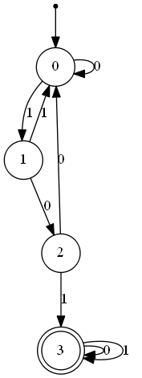
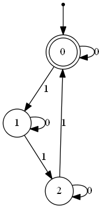

# GOLD 

## Description

GOLD is a C++ application which serves as a proof of concept for learning languages [1]. Here, we consider [regular languages](https://en.wikipedia.org/wiki/Regular_language) as represented by [deterministic finite automata (DFA)](https://en.wikipedia.org/wiki/Deterministic_finite_automaton). The source of data is modeled by the concept of an _informant_, while the learner is modeled by that of a _scientist_. The informant supplies words (strings of zeros and ones) which belong or do not belong to the language. The aim is to find the DFA with the least number of states that corresponds to the language the data is drawn from.

This application was first developed in the context of a BSc project supervised by [Dr. José Felix Costa](https://cfcul.ciencias.ulisboa.pt/equipa/jose-felix-costa/).

## Usage

A typical usage pattern is as follows:

1. Select an informant using `informant 'x'` or `informant load filename.txt` (see [Informant-related commands](#informant-related-commands)). 
    * _(Optional)_ Select an enumeration using `enum 'x'` (see [Enumeration related commands](#enumeration-related-commands)
    * _(Optional)_ Select maximum number of states using `max_states 'n'`
    * _(Optional)_ Select maximum number of tested words using `max_words 'n'`
5. Run the identification algorithm using `identify`
6. Draw the DFA using `dfa draw`
    * _(Optional)_ Save the graph using `dfa savegraph filename.txt`
    * _(Optional)_ Save the DFA information using `dfa save filename.txt`
    * _(Optional)_ Save the informant `informant save filename.txt`

## Examples

### Example 1

```
informant ex_pattern 101
print
identify
dfa draw
informant save inf.txt
```

After the `print` command, the following data should appear in the console (and should be the contents of `inf.txt` after the `informant save inf.txt` command):

```
0	
0	0
0	1
0	00
0	01
0	10
0	11
0	000
0	001
0	010
0	011
0	100
1	101
0	110
0	111
0	0000
0	0001
0	0010
0	0011
0	0100
1	0101
0	0110
0	0111
0	1000
0	1001
1	1010
1	1011
0	1100
0	1101
0	1110
0	1111
```

The graph drawn is:



### Example 2

```
informant load load.txt
identify
dfa draw
dfa savegraph graph.png
dfa save info.txt
```

Assuming load.txt has informant data:

```
1	0
1	00
1	111
1	111111
0	1
0	1111
1	101010
1	010101
```

The graph drawn is



## Command List & Details

At any point, the user can type `help` to see a summary of all available commands. The full list of commands and associated details is:


### Informant-related commands

* `informant` - shows currently selected and available informants
* `informant 'x'` - changes informant to `x`. There are currently four available informants hard-coded into the application:
    * `even1s` - informant for language composed of words that have even number of ones $\\{w \in \Sigma^*:$ w has an even number of ones $\\}$.
    * `random` - simply outputs a randomly generated sequence of 32-bit words. A priori not associated with any regular language.
    * `ex_pattern 'p'` - informant for language that accepts words containing $p$ ie. $\\{w \in \Sigma^*:\exists \; u, v \in \Sigma^*$ such that $w = upv\\}$.
    * `rep_pattern 'p'` - informant for language that accepts words constructed by repeating sequence $p$, ie. $\\{w \in \Sigma^*:w = p^n,n \in \mathbb{N}\\}$.
* `informant save 'filename'` - saves data from current informant to the designated file, up to `max_words` elements.
* `informant load 'filename'` - creates informant from data in designated file.
* `print` - Prints current informant data to console. Note that the informant is only printed up until `max_words` elements.

For the `informant save 'filename'`, `informant save 'filename'` and `informant load 'filename'` commands, the information has the format $<0$ or $1><$ tab space $><$ sequence of $0$ s and $1$ s $>$, 
where the first component indicates whether the word should be accepted or rejected. The empty word omits the last part i.e. it takes the form $<0$ or $1><$ tab space $>$.

### DFA related commands

* `dfa draw` - opens a window with a picture last identified DFA. 
* `dfa save filename.txt` - saves DFA structure in the [graphviz](http://www.graphviz.org/content/dot-language) format to the designated file. Note that the file extension `.txt` must be included.
* `dfa savegraph filename.png` - saves DFA graph to the designated file. Note that the file extension .png must be included.
* `identify` - runs the exhaustive search in order to identify DFA associated with selected informant.
* max_words `'n'` - changes maximum number of tested words to $n$.
* max_states `'n'` - changes maximum number of tested DFA states to $n$.

### Enumeration related commands

* `enum` - shows currently selected and available DFA enumerations
* `enum 'x'` - changes enumeration to `'x'`. There are two available enumerations:
    * `reisenum` - enumeration based on [2], which excludes certain equivalent DFA.
    * `naive` - naive exhaustive enumeration. Note that this is legacy and is left only for testing puproses. If it is chosen, a small number for `max_states` should be set.

### Miscellaneous

`update` - in order to facilitate iterative modification-and-identification of an informant supplied from a file, this command was created. One should first load an informant; if the file is altered, this command automatically reloads it, runs the identification process and opens the corresponding graph (if a DFA was identified).

## Installation

### Compile from source

You must make sure that all dependencies are installed; these are:
* [boost](https://www.boost.org/)
* [graphviz](http://www.graphviz.org/)
* [SDL](https://www.libsdl.org/) and [SDL-image](https://github.com/libsdl-org/SDL_image/releases)

If your package manager is `apt` (i.e. if you're using Ubuntu or another Debian based Linux distribution), you can install these by running `sudo apt install libboost-dev libsdl2-dev libsdl-image1.2-dev libgraphviz-dev libgd-dev fontconfig libcairo2-dev libpango1.0-dev libgts-dev`.

The project uses [CMake](https://cmake.org/) as its build system. To build the application, change to the [source](source) directory and run `cmake .` followed by `make`. You may need to modify [the CMake source](CMakeLists.txt) if it can not find the installed libraries.

## References

1. Gold, E. M. (1967). Language Identification in the Limit. Information and Control, 10(5), 447–474. https://doi.org/10.1016/S0019-9958(67)91165-5

2. Almeida, M., Moreira, N., Reis, R. (2007). Enumeration and generation with a string automata representation. Theoretical Computer Science, 387, 93–102. https://doi.org/10.1016/j.tcs.2007.07.029

3. Almeida, M., Reis, R. (2006). Efficient representation of integer sets. Technical Report DCC-2006-06, DCC-FC & LIACC, Universidade do Porto.
